> 日本語版はこちら: [README.ja.md](README.ja.md)

# Wi-Fi Analyzer with Mist & Aruba Central Integration

An Android Wi-Fi analyzer app for network engineers, featuring real-time BSSID scanning,
AP name resolution via Juniper Mist and HPE Aruba Central APIs, and snapshot-based field survey tools.

## Features

### Wi-Fi Scanning
- Real-time BSSID scanning with RSSI, Channel, Channel Width, Security, Band
- Vendor lookup via IEEE OUI database (39,000+ entries)
- Filter by SSID, Band (2.4/5/6 GHz), Security type
- Sort by RSSI, SSID, or Channel
- Auto-scan with configurable interval (5s / 10s / 30s)
- OS throttle detection with cached result display

### AP Name Resolution
- **Juniper Mist**: Resolves AP names via Mist API using radio MAC prefix matching
  - Supports Org-wide or Site-specific sync
  - Cloud region selection (Global 01-04, EMEA 01-03, APAC 01)
- **HPE Aruba Central**: Resolves AP names via BSSID exact match
  - Supports Site filtering using OData filter syntax
  - Multi-cluster support (Internal, US, EU, APAC, Canada, UAE, China)
  - OAuth2 token auto-refresh

### Monitor Screen
- Real-time graphs for connected AP: RSSI, TX/RX Speed, Channel
- Auto-updates every second

### RSSI Comparison
- Long-press to select multiple BSSIDs
- Multi-series RSSI trend graph with color-coded legend

### Snapshot & Export
- Save scan results as named snapshots with location/floor metadata
- CSV export with full BSSID details including AP names
- Share via Android Share Sheet

## Installation

Download the latest debug APK from the [Releases](https://github.com/kshimonoj/wifi-analyzer-mist-central/releases) page.

1. Enable **"Install unknown apps"** in Android Settings
2. Download `wifi-analyzer-*-debug.apk` from the latest release
3. Tap the APK to install
4. Grant **Location** permission on first launch (required for Wi-Fi scanning)

## How to Use the Android App

The app has five tabs along the bottom navigation bar: **Scan**, **Snapshots**, **Monitor**, **Map**, and **Settings**.

### Tab Overview

#### 📡 Scan
Displays a real-time list of nearby BSSIDs with RSSI, channel, band, security, and resolved AP name. Use the filter and sort controls at the top to narrow the list. Tap auto-scan to refresh at a fixed interval.

<!-- SCREENSHOT: Scan screen — place screenshot of the scan list here -->
<p align="center">
  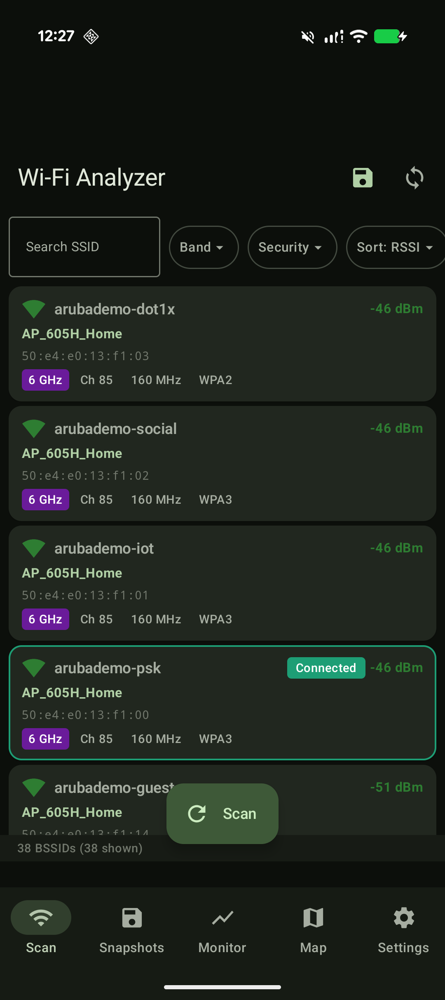
</p>

#### 💾 Snapshots
Lists saved snapshots. Each snapshot captures the full scan result at a point in time, with optional location/floor metadata. From here you can export a survey ZIP or delete snapshots in bulk.

<!-- SCREENSHOT: Snapshots screen — place screenshot of the snapshot list here -->
<p align="center">
  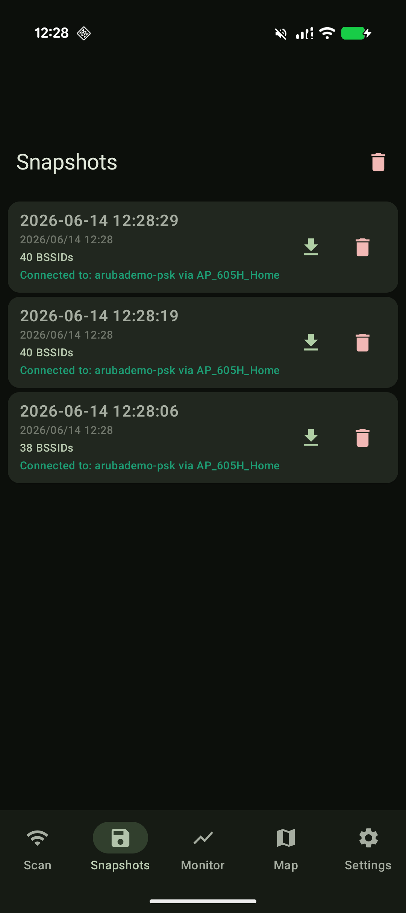
</p>

#### 📈 Monitor
Shows real-time graphs for the currently connected AP: RSSI, TX/RX speed, and channel, updated every second. Useful for observing live link quality.

<!-- SCREENSHOT: Monitor screen — place screenshot of the monitor graphs here -->
<p align="center">
  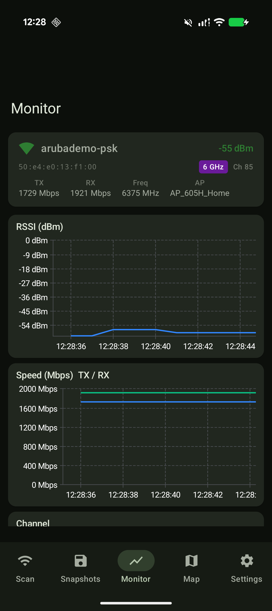
  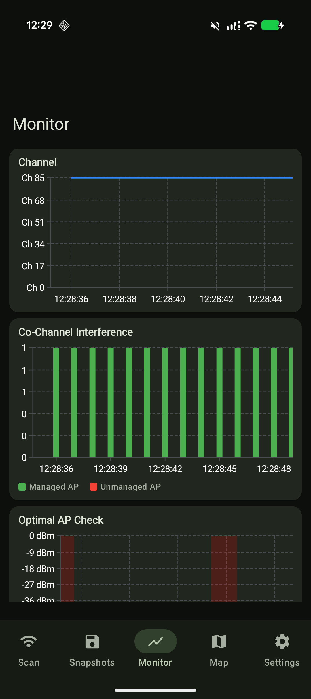
  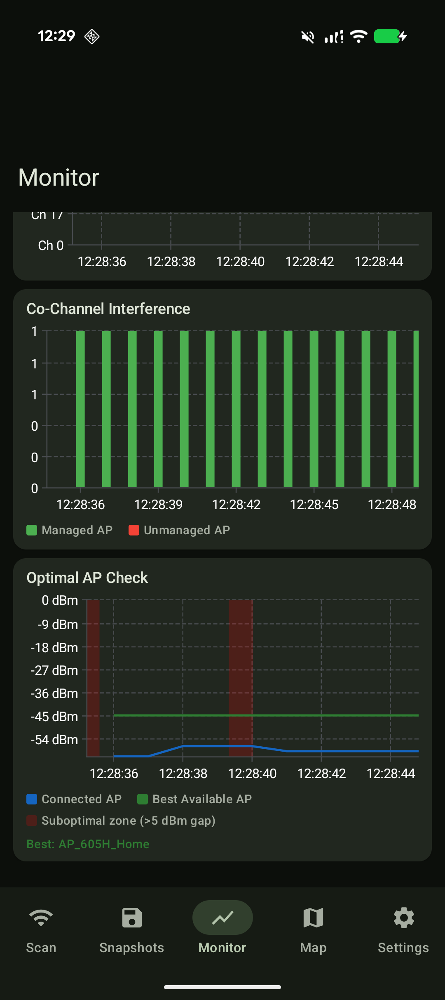
</p>

#### 🗺️ Map
Imports a floor map (from Mist API, Aruba Central API, or a local file), plots AP locations, and lets you place snapshots on the map by tapping. Connection lines link each snapshot to its connected AP. This is the core of the field survey workflow.

**Top bar icons** (left to right):

| Icon | Function |
|------|----------|
| **Select** (dropdown) | Choose or switch the floor map to display. The currently selected site/floor is shown above (e.g. "Home - Home6F"). |
| **Nine-dot icon** | Fetch the floor map and AP location data. |
| **Router icon** | Fetch AP location data. |
| **Link / chain icon** | Toggle connection lines on/off — the lines linking each snapshot to the AP it was connected to. |
| **Sync** | Sync the AP info and map data for the current site/floor to the latest state. |
| **Download** (down arrow) | Export the survey data — bundles the floor map, AP locations, and all snapshots into a ZIP for analysis in the web analyzer. |

> Note: The exact behavior of the nine-dot and router icons cannot be fully distinguished from the UI alone; the descriptions above are approximate.

<!-- SCREENSHOT: Map screen — place screenshot of the floor map with placed snapshots here -->
<p align="center">
  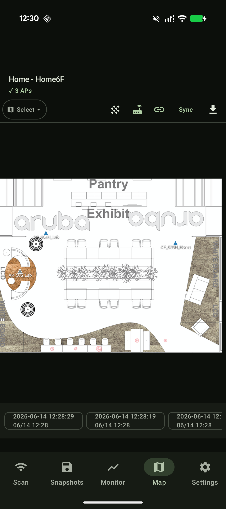
  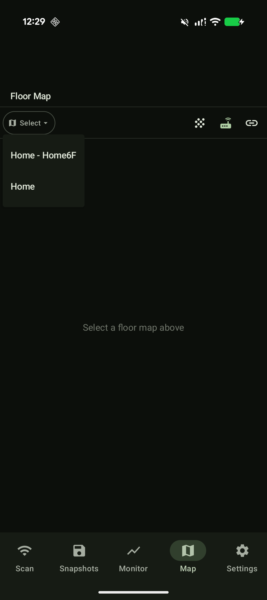
</p>

#### ⚙️ Settings
Configure Mist and Aruba Central API credentials, select cloud region/cluster, and sync AP names. See the [Setup](#setup) section below.

<!-- SCREENSHOT: Settings screen — place screenshot of the settings screen here -->
<p align="center">
  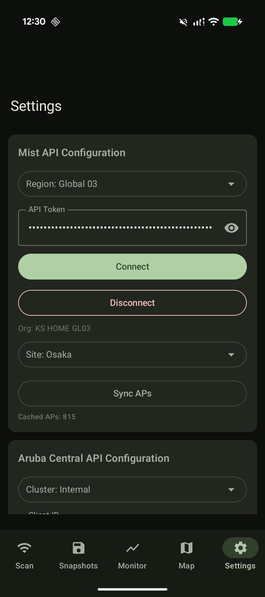
  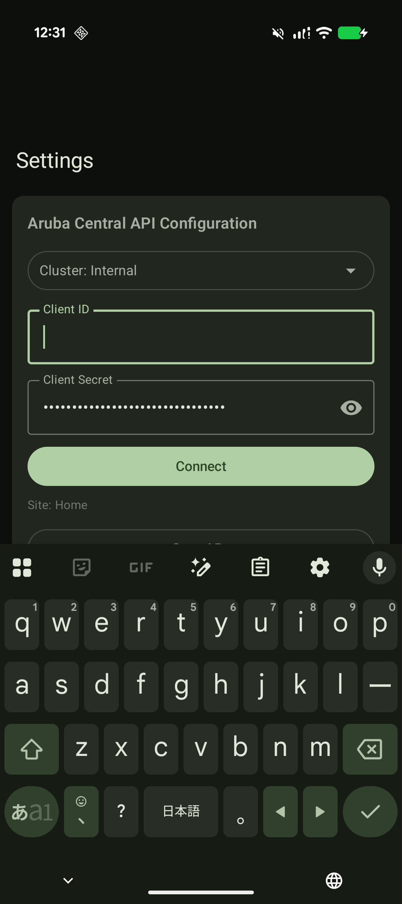
  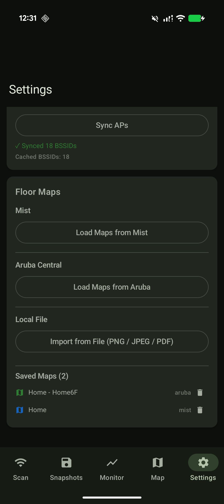
</p>

### Typical Survey Workflow

This is the end-to-end flow for running a Wi-Fi field survey and analyzing the results:

1. **Configure AP resolution** (Settings tab)
   Enter your Mist or Aruba Central credentials and tap **Sync APs** so scanned BSSIDs resolve to friendly AP names.

2. **Import a floor map** (Map tab)
   Load the floor plan from Mist / Aruba Central API or a local image file. AP locations are plotted automatically when available.

3. **Scan and place snapshots** (Scan → Map tab)
   Walk to each measurement point, take a scan, save it as a snapshot, then place it on the floor map by tapping the location where you are standing.

<!-- SCREENSHOT: Placing a snapshot on the map — place screenshot showing snapshot placement here -->
<p align="center">
  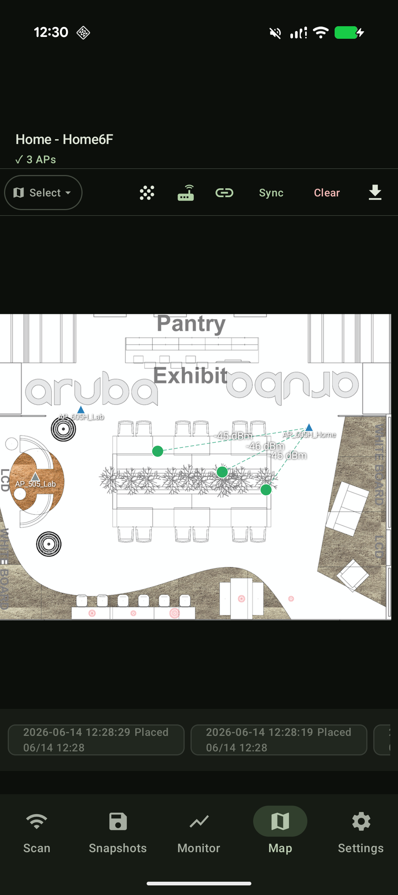
</p>

4. **Export the survey ZIP** (Map tab → Export)
   Export a ZIP containing the floor map, AP locations, and all snapshots.

5. **Analyze in the web tool**
   Upload the ZIP to the [Survey Analyzer](#survey-analyzer-web-tool) to view RSSI heatmaps, roaming analysis, co-channel interference, and optimal-AP checks.

> **Note on snapshot placement:** Snapshot positions are saved in the floor map's coordinate frame. If you re-import or update a floor map, re-place existing snapshots to keep their positions aligned.

## Requirements

- Android 10 (API 29) or higher
- Location permission (required for Wi-Fi scanning)

## Tested Devices

| Device | Android Version | Notes |
|--------|----------------|-------|
| Pixel 9 | Android 16 | Primary test device |

## Tech Stack

- **Language**: Kotlin
- **UI**: Jetpack Compose + Material3
- **Architecture**: MVVM
- **DI**: Hilt
- **Database**: Room
- **HTTP**: Ktor Client
- **Charts**: Vico
- **Async**: Coroutines + Flow
- **Settings**: DataStore Preferences

## Setup

### Mist API
1. Open Settings screen in the app
2. Select Cloud Region
3. Enter your Mist API Token
4. Tap "Test Connection"
5. Select Org and Site
6. Tap "Sync APs"

### Aruba Central API
1. Open Settings screen in the app
2. Select Cluster
3. Enter Client ID and Client Secret (from HPE GreenLake)
4. Tap "Test Connection"
5. Select Site (optional)
6. Tap "Sync APs"

## Repository Structure

This repository contains two components:

- Root directory + `app/` — Android Wi-Fi Analyzer app
- `analyzer/` — Web-based survey analyzer (Streamlit + Docker)

The Android project files (build.gradle.kts, settings.gradle.kts, etc.)
live in the root. The analyzer is a standalone tool in its own subdirectory.

```
analyzer/
├── Dockerfile
├── docker-compose.yml
├── requirements.txt
└── app/
    ├── app.py          # Streamlit main app
    ├── analysis.py     # Analysis logic
    └── map_plot.py     # Floor map visualization
```

## Architecture

```
app/
├── data/
│   ├── wifi/          # WifiScanner, ScanResultMapper, ConnectedApMonitor
│   ├── mist/          # MistApiClient, MistRepository
│   ├── aruba/         # ArubaApiClient, ArubaRepository
│   ├── oui/           # OuiVendorRepository
│   ├── db/            # Room Database, DAOs, Entities
│   └── settings/      # DataStore SettingsRepository
├── domain/
│   ├── model/         # WifiObservation, BssidSummary, Snapshot
│   └── usecase/       # ExportCsvUseCase
└── ui/
    ├── scan/          # ScanScreen, ScanViewModel
    ├── monitor/       # MonitorScreen, MonitorViewModel
    ├── compare/       # CompareGraphScreen
    ├── snapshot/      # SnapshotListScreen, SnapshotViewModel
    ├── map/           # FloorMapScreen, MapViewModel
    └── settings/      # SettingsScreen, SettingsViewModel
```

## Survey Analyzer (Web Tool)

A Streamlit-based analysis tool for survey data exported from this app.

```bash
cd analyzer
docker-compose up
# Open http://localhost:8501
```

Upload a survey ZIP to view:
- Floor map with measurement points and connection lines
- AP-unit RSSI aggregation (not BSSID-unit)
- Roaming detection and roaming issue flags
- Co-channel interference per point (managed vs unmanaged APs)
- Optimal AP selection check (connected vs best available)
- 2.4/5/6 GHz band analysis

See [analyzer/README.md](analyzer/README.md) for details.

## Known Limitations

### Wi-Fi Scan Throttling (Android 9+)

Android 9 and later enforce OS-level limits on Wi-Fi scan frequency:

- **Foreground**: up to 4 scans per 2 minutes
- **Background**: up to 1 scan per 30 minutes

When the limit is reached, the app displays cached results from the previous scan and shows the warning banner **"Scan throttled by OS – showing cached results"**.

Additional notes:
- Other apps performing Wi-Fi scans contribute to the same quota, making throttling more likely in busy environments.
- Using Auto-scan with a short interval (e.g. 5 s) increases the chance of hitting the limit quickly.
- Throttling strictness may vary by device manufacturer and Android version.

## License

MIT License - see [LICENSE](LICENSE) for details.

## Acknowledgements

- [IEEE OUI Database](https://standards-oui.ieee.org/) for vendor lookup
- [Vico](https://github.com/patrykandpatrick/vico) for chart rendering
- [Juniper Mist API](https://www.mist.com/documentation/)
- [HPE Aruba Central API](https://developer.arubanetworks.com/new-central/)
